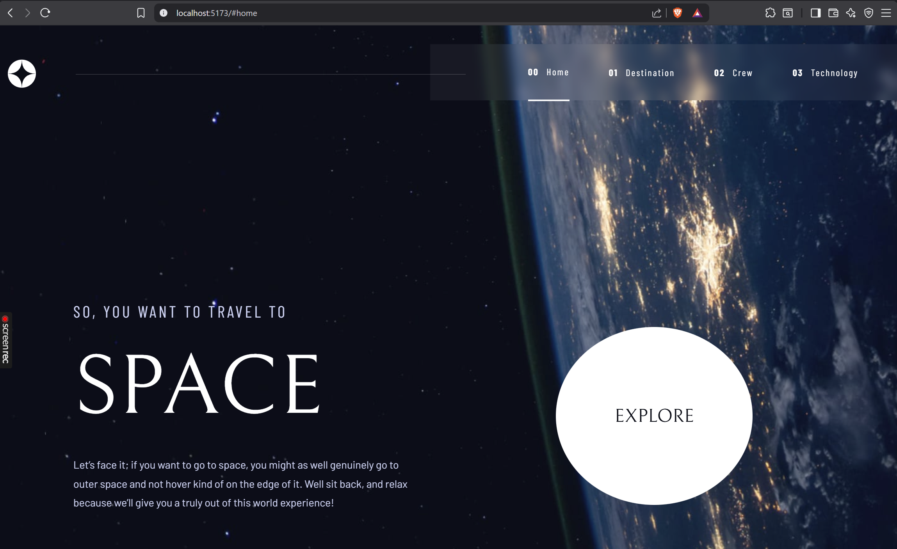
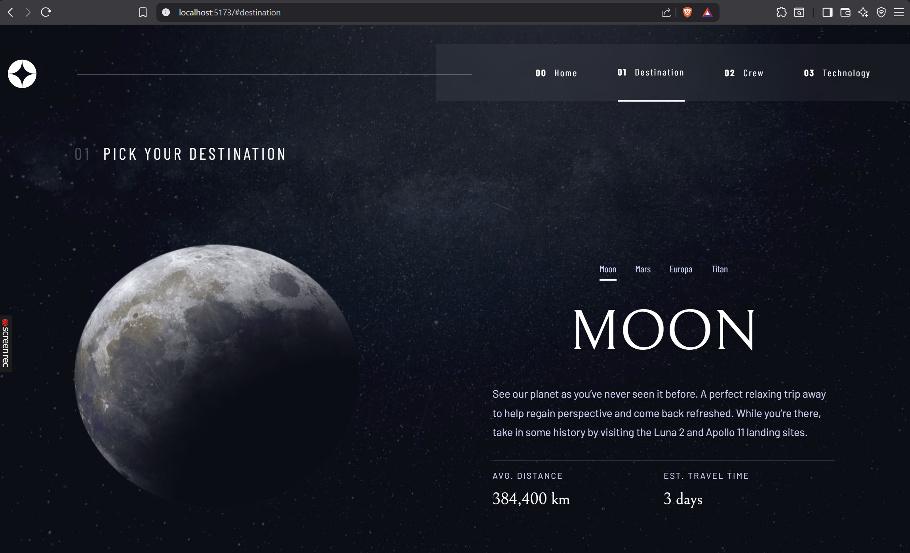
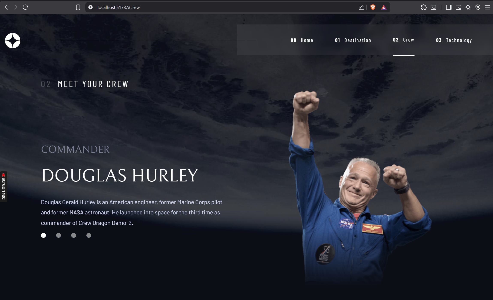
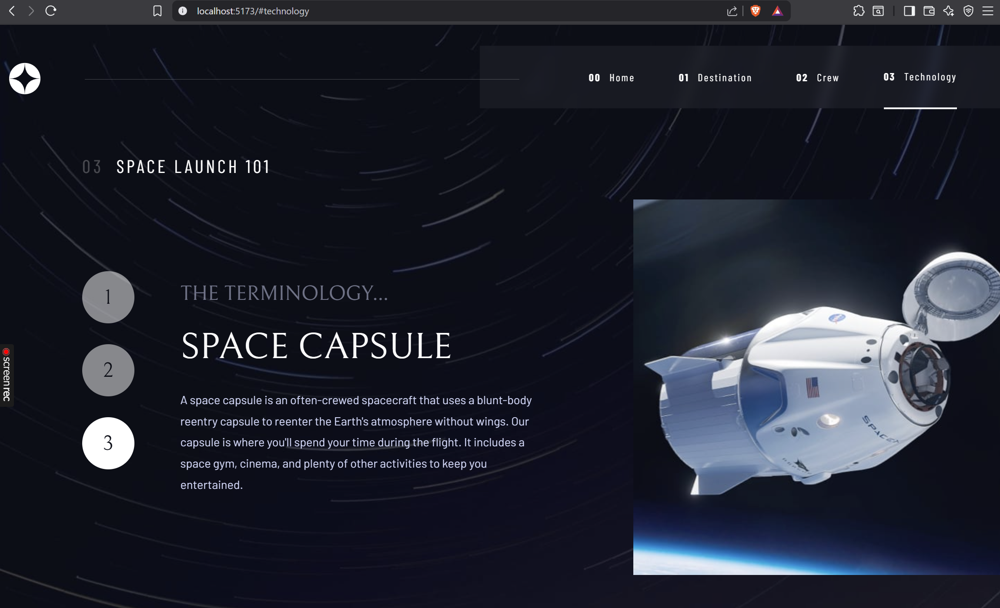
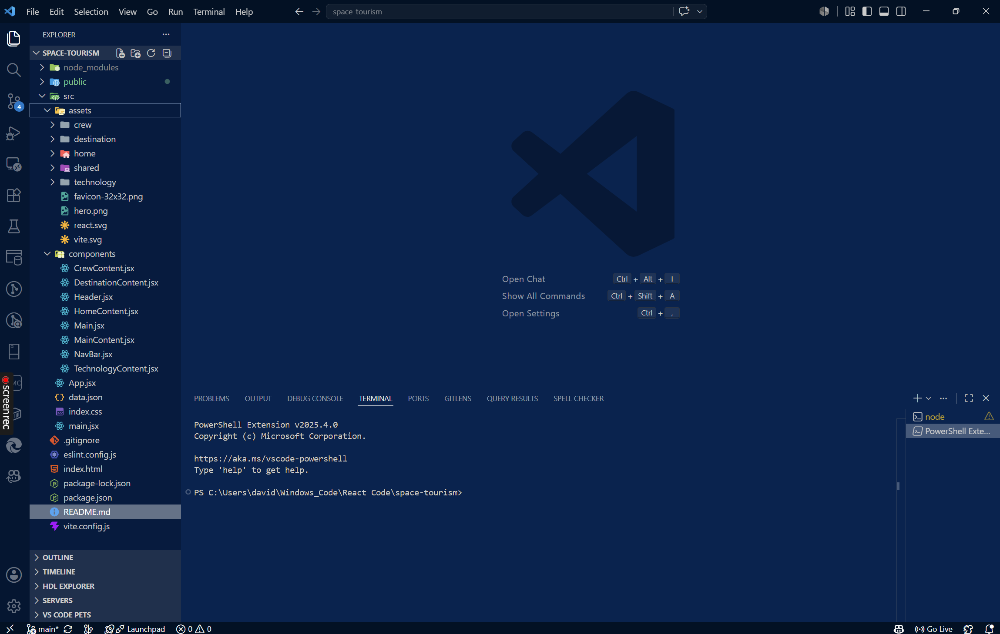

# Space Tourism

Frontend Mentor solution for the Space Tourism multipage website challenge, built with React and Vite.

## Table of Contents

- [Space Tourism](#space-tourism)
  - [Table of Contents](#table-of-contents)
  - [Overview](#overview)
    - [Screenshot](#screenshot)
    - [Links](#links)
  - [Features](#features)
  - [Built With](#built-with)
  - [Project Structure](#project-structure)
    - [What I learned](#what-i-learned)
  - [Getting Started](#getting-started)
  - [Available Scripts](#available-scripts)
  - [Notes](#notes)
  - [Author](#author)

## Overview

This project recreates a space-themed travel website with four interactive sections: Home, Destination, Crew, and Technology. The app uses shared state to switch between pages and update the displayed content without a full page reload.

### Screenshot











### Links

- Solution URL: (https://github.com/DavidMbagwu/space-tourism)
- Live Site URL: [Add live site URL here](https://david-space-tourism.netlify.app/)

## Features

- Responsive layout for desktop and smaller screens
- Top navigation for switching between the four sections
- Interactive destination tabs for Moon, Mars, Europa, and Titan
- Crew selector with profile bubbles
- Technology selector with numbered navigation
- Data-driven content loaded from a shared JSON file

## Built With

- React 19
- Vite
- JavaScript (ES modules)
- CSS
- ESLint

## Project Structure

- `src/App.jsx` sets up the page context and current section state
- `src/components/Header.jsx` renders the logo and navigation
- `src/components/Main.jsx` renders the active page heading
- `src/components/MainContent.jsx` switches between the page content blocks
- `src/data.json` stores the destination, crew, and technology data
- `src/assets/` contains the page imagery and shared assets

### What I learned

During this project, I deepened my understanding of state-driven layouts and handling complex responsive design problems:

- Handling Component Unmounting Animations: Solved the limitation where CSS animations don't replay on state updates by strategically utilizing React's key attribute to force element remounting.

- Flexbox Overflow & Wrapping: Overcame layout bugs where long strings blocked text wrapping by using min-width: 0 inside parent containers to ensure text blocks behave fluidly.

## Getting Started

Clone the repository, install dependencies, and start the dev server:

```bash
npm install
npm run dev
```

## Available Scripts

- `npm run dev` starts the Vite development server
- `npm run build` creates a production build
- `npm run preview` previews the production build locally
- `npm run lint` runs ESLint across the project

## Notes

The current implementation uses local component state and shared context to control page selection. Background classes are also updated per section so each view can use its own visual treatment.

## Author

- **Frontend Mentor** – https://www.frontendmentor.io/profile/DavidMbagwu
- **GitHub** – https://github.com/DavidMbagwu
